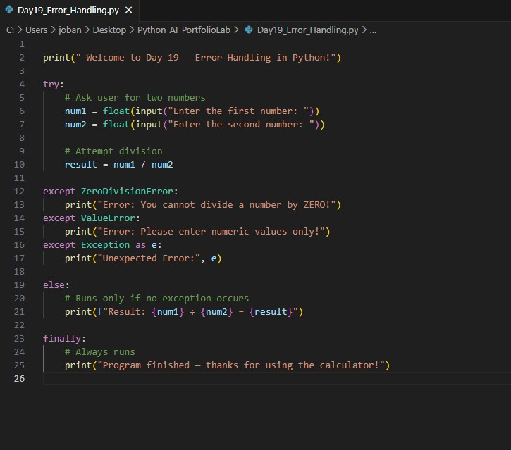
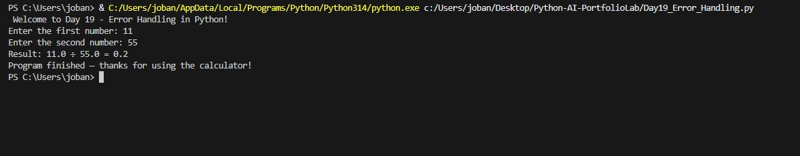

# 📘 Day 19: Error Handling in Python (try, except, else, finally)
_✨ Part of the **Python & AI 90 Days Learning Journey**_

---

## 🧠 Overview

Error handling is a powerful feature in Python that allows programs to continue running even when they encounter unexpected input or invalid operations.  
Instead of crashing, well-designed programs guide the user and handle issues gracefully.

### 💎 Why Error Handling Matters
◆ Prevents unexpected program crashes  
◆ Provides meaningful feedback to the user  
◆ Helps developers debug smarter and faster  
◆ Ensures smooth execution even with invalid input  
◆ Makes applications production-ready and resilient  

---

# 🧩 Mini Project:  Number Division Program

This project demonstrates how to safely divide two numbers while handling common user mistakes.

### 💎 The Program Handles
◆ **ZeroDivisionError** — When the user attempts to divide by zero  
◆ **ValueError** — When a non-numeric value is entered  
◆ **Exception** — Catches any unexpected errors  
◆ **else block** — Runs only when no errors occur  
◆ **finally block** — Always executes for cleanup or closing messages  

---

# 🧪 Python Code: Day19_Error_Handling.py

```python
print("Welcome to Day 19 - Error Handling in Python!")

try:
    # Ask user for two numbers
    num1 = float(input("Enter the first number: "))
    num2 = float(input("Enter the second number: "))

    # Attempt division
    result = num1 / num2

except ZeroDivisionError:
    print("Error: You cannot divide a number by ZERO!")
except ValueError:
    print("Error: Please enter numeric values only!")
except Exception as e:
    print("Unexpected Error:", e)

else:
    # Runs only if no exception occurs
    print(f"Result: {num1} ÷ {num2} = {result}")

finally:
    # Always runs
    print("Program finished — thanks for using the calculator!")

🖼️ Screenshots
Place your screenshots inside the folder below:
Screenshots/
├── Day19_Code.jpg
└── Day19_Output.jpg

Add them to your README like this:



📂 Project Folder Structure
Day19_Error_Handling/
│── Day19_Error_Handling.py
│── README.md
└── Screenshots/
    ├── Day19_Code.jpg
    └── Day19_Output.jpg

🎯 What You Learned Today
💎 Key Takeaways
◆ What exceptions are and why they occur
◆ How to use try, except, else, and finally effectively
◆ How to prevent your code from crashing
◆ How to catch multiple error types
◆ How to build user-friendly and safe programs
◆ How structured error handling is used in real-world systems

🏁 Conclusion
Day 19 gives you a strong foundation in writing safe and reliable programs.
You now understand how to manage invalid inputs, avoid crashes, and build user-friendly applications — a key skill for professional Python development.

